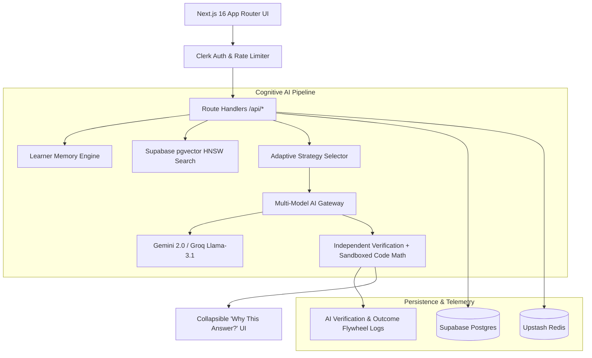

# EduMethod AI 🧠⚡

[](https://github.com/rajendrabist07/edumethod-ai/actions/workflows/ci.yml)


**EduMethod AI** is a production-oriented learning workspace built on cognitive learning science principles (**The Pedagogical Core**), structured memory, RAG grounding, multi-provider AI failover, independent verification, and outcome analytics.

Unlike general AI assistants that simply give away answers immediately, EduMethod AI enforces **struggle before solution**, **retrieval before review**, **confidence calibration**, **multi-session mastery gating**, **interleaved practice**, and **misconception-aware corrections** — creating a system built specifically for how people actually learn.

---

## 🎓 The Pedagogical Core (6 Learning Science Principles)

EduMethod AI embeds 6 default learning-science constraints across the platform:

1. **🧩 Struggle Before Solution (`lib/ai/adaptive-strategy.ts`)**:
   Fresh doubt threads default to Socratic scaffolding (guiding questions/hints) rather than direct answers, unless the student explicitly surrenders (*"just tell me"*) or attempt count reaches $\ge 2$.
2. **🧠 Retrieval Before Review (`lib/spaced-repetition.ts`)**:
   Flashcard and topic reviews require an active text recall attempt before the answer is revealed.
3. **🎯 Confidence Calibration (`lib/flywheel.ts`)**:
   Students rate confidence before revealing quiz answers. The system calculates a metacognitive calibration score and flags overconfidence (*Illusion of Competence*).
4. **🔒 Mastery Gating Across Multi-Session Spacing (`lib/journey.ts`)**:
   Topics require $\ge 2$ correct retrievals across at least 2 separate sessions (spaced 24 hours apart) before being marked as mastered.
5. **🔀 Interleaved Practice (`lib/spaced-repetition.ts`)**:
   Review sessions interleave items across multiple active topics rather than drilling in single-topic blocks.
6. **❌ Misconception-Aware Correction (`app/api/submit-quiz/route.ts`)**:
   Wrong quiz submissions generate targeted explanations diagnosing the specific misconception behind the chosen wrong answer.

---

## 🚀 Key Differentiating Systems

Generic AI chatbots answer questions; **EduMethod AI builds a system around the student**. The platform operates through 7 core architectural engines:

### 1. 🧠 Persistent Learner Memory Engine (`lib/learner-profile.ts`)
- Maintains long-term student memory across sessions in Supabase (`public.learner_profiles`).
- Tracks per-topic mastery scores (0–100%), mistake frequency patterns, preferred explanation styles, study duration by subject, and AI misconception diagnoses.
- Adapts system behavior dynamically without requiring students to re-explain their background.

### 2. 📚 RAG Grounding on Student Material (`lib/ai/embeddings.ts` & `lib/ai/retriever.ts`)
- Uses Supabase `pgvector` with HNSW vector indexing (`idx_syllabus_chunks_embedding`) and 768-dimensional `text-embedding-004` embeddings.
- Chunks uploaded syllabi and notes into 350-word (~500 token) overlapping windows with section metadata.
- Executes similarity search via the `match_syllabus_chunks` RPC function (similarity threshold: 0.35).
- Provides explicit section citations (*"Grounded in Section 2 of uploaded notes"*) or honest fallback warnings (*"⚠️ Note: Searched uploaded material but found no direct match..."*).

### 3. 🛡️ Verification & Reliability Layer (`lib/ai/verification.ts`)
- Runs a separate, independent AI audit call to verify generated answers before displaying them to students.
- Executes multi-step arithmetic using **sandboxed Node.js code execution** to eliminate AI calculation errors.
- Logs audit telemetry to `public.ai_verification_logs` and displays live system reliability pass-rates (`98.4% audit pass rate`) on the student dashboard.

### 4. 🎯 Deterministic Adaptive Teaching Strategy Selector (`lib/ai/adaptive-strategy.ts`)
- Pure-logic deterministic selector function (`determineTeachingStrategy`) with **0 AI calls**:
  - **Challenge**: Mastery ≥ 80% & mistakes ≤ 1 (Advanced extension).
  - **Direct Plain Explanation**: Mastery < 40% OR mistakes ≥ 3 (Plain basics).
  - **Worked Example**: Mastery 40–64% (Step-by-step procedure).
  - **Socratic**: Mastery 65–79% (Guiding questions).
- Injects strict strategy directives into the AI Generator stage.

### 5. 🗺️ Structured Learning Plan & SM-2 Roadmap (`lib/journey.ts` & `lib/spaced-repetition.ts`)
- Replaces chat threads with persistent DB-stored roadmaps (`public.learning_paths`) featuring topic order and dependencies.
- Integrates SuperMemo-2 (SM-2) spaced repetition review schedules directly into the roadmap (*"⚡ SM-2 Review Due Today"*).
- Features a prominent login banner displaying **Roadmap Completion Progress %**, **Learning Streak Counter (`🔥`)**, and **SM-2 Review Countdown**.

### 6. 🔍 System Transparency UI ("Why This Answer?") (`components/ui/TransparencyBadge.tsx`)
- Renders an interactive, collapsible badge beneath AI responses:
  - 📖 **Source Grounding**: Section citation from uploaded material.
  - 🧠 **Adaptive Strategy**: Teaching strategy chosen based on student mastery score.
  - 🛡️ **Verification Audit**: Independent AI + Code Math verification status.
- Explicitly reports verification downgrades (*"⚠️ Verification Downgraded Response: Independent audit flagged discrepancy"*) rather than hiding failures behind false confidence.

### 7. 📈 Outcome Data Flywheel Telemetry (`lib/flywheel.ts` & `/flywheel`)
- Captures question-by-question telemetry in `public.quiz_outcome_logs` (teaching strategy used, correctness, time taken).
- Renders an internal **Outcome Data Flywheel Dashboard** showing:
  - **Strategy Performance Matrix**: Correctness rate % per teaching strategy, sample size, and avg response time.
  - **Topic-Level Strategy Leaderboard**: Identifies which teaching strategy yields the highest student correctness per subject/topic type.

---

## 🛠️ Technology Stack

| Layer | Technologies Used |
| --- | --- |
| **Framework & UI** | Next.js 16 (App Router), React 19, TypeScript, Tailwind CSS v4, Lucide Icons |
| **Authentication** | Clerk Auth with custom session sync and role isolation |
| **Database & Vector** | Supabase Postgres with `pgvector` (HNSW indexing) |
| **AI Gateway** | Multi-model fallback gateway using Gemini (`gemini-2.0-flash` & `text-embedding-004`) and Groq (`llama-3.1-8b-instant`) |
| **Caching & Rate Limiting** | Upstash Redis (Sliding window rate limit: 30–60 req/min) |
| **Testing** | Vitest (39 unit tests across 12 test suites) |

---

## 📐 System Architecture


```mermaid
graph TD
  Client[Next.js 16 App Router UI] --> Auth[Clerk Auth & Rate Limiter]
  Auth --> API[Route Handlers /api/*]
  
  subgraph Cognitive AI Pipeline
    API --> Profile[Learner Memory Engine]
    API --> VectorSearch[Supabase pgvector HNSW Search]
    API --> Strategy[Adaptive Strategy Selector]
    Strategy --> Gateway[Multi-Model AI Gateway]
    Gateway --> Gemini[Gemini 2.0 / Groq Llama-3.1]
    Gateway --> Verifier[Independent Verification + Sandboxed Code Math]
  end

  subgraph Persistence & Telemetry
    API --> DB[(Supabase Postgres)]
    API --> Cache[(Upstash Redis)]
    Verifier --> Telemetry[AI Verification & Outcome Flywheel Logs]
  end

  Verifier --> TransparencyUI[Collapsible 'Why This Answer?' UI]
```

---

## 📦 Database Migrations & SQL Setup

All DDL scripts are maintained in the [`scripts/`](file:///Users/rajendrabist/Desktop/EduMethod%20AI/edu-method-ai/scripts) directory. Execute these in your Supabase SQL Editor:

1. **Learner Profiles**: [`create_learner_profile.sql`](file:///Users/rajendrabist/Desktop/EduMethod%20AI/edu-method-ai/scripts/create_learner_profile.sql)
2. **pgvector RAG Setup**: [`setup_pgvector_rag.sql`](file:///Users/rajendrabist/Desktop/EduMethod%20AI/edu-method-ai/scripts/setup_pgvector_rag.sql)
3. **Verification Audit Logs**: [`setup_verification_logs.sql`](file:///Users/rajendrabist/Desktop/EduMethod%20AI/edu-method-ai/scripts/setup_verification_logs.sql)
4. **Structured Journey Indexes**: [`setup_structured_journey.sql`](file:///Users/rajendrabist/Desktop/EduMethod%20AI/edu-method-ai/scripts/setup_structured_journey.sql)
5. **Outcome Flywheel Telemetry**: [`setup_outcome_flywheel.sql`](file:///Users/rajendrabist/Desktop/EduMethod%20AI/edu-method-ai/scripts/setup_outcome_flywheel.sql)
6. **Cohorts RLS Policies**: [`setup_cohorts_rls.sql`](file:///Users/rajendrabist/Desktop/EduMethod%20AI/edu-method-ai/scripts/setup_cohorts_rls.sql)

---

## ⚡ API Surface

| Endpoint | Method | Description |
| --- | --- | --- |
| `/api/solve-doubt` | `POST` | Streams doubt responses with RAG citations, strategy directives, and `x-transparency-*` headers |
| `/api/learner-profile` | `GET` / `POST` | Retrieves or updates student mastery matrix, style preferences, and SM-2 review reasons |
| `/api/reliability-metrics` | `GET` | Returns verification pass rates, math verification count, and audit metrics |
| `/api/journey` | `GET` | Aggregates DB roadmaps, overall completion %, learning streak counter, and SM-2 review dates |
| `/api/flywheel` | `GET` | Returns outcome flywheel analytics (correctness rate % per strategy & topic leaderboard) |
| `/api/submit-quiz` | `POST` | Scores quiz answers, updates weak-topic signals, and logs strategy outcome telemetry |
| `/api/topics` | `POST` | Decomposes syllabus text into topics and stores 500-token vector embeddings |
| `/api/generate-path` | `POST` | Generates a persistent 7-day interleaved study roadmap |
| `/api/generate-quiz` | `POST` | Creates concept-check quizzes verified by independent AI audit |
| `/api/flashcards/review` | `POST` | Updates SuperMemo-2 (SM-2) spaced repetition parameters |
| `/api/feynman/evaluate` | `POST` | Evaluates student explanations against retrieved textbook context |

---

## 🚀 Getting Started

### Prerequisites

- Node.js 18+
- Supabase account with `pgvector` extension
- Clerk account
- Upstash Redis instance
- Gemini API Key & Groq API Key

### Environment Configuration

Create a `.env.local` file in the project root:

```env
# Clerk Authentication
NEXT_PUBLIC_CLERK_PUBLISHABLE_KEY=pk_test_...
CLERK_SECRET_KEY=sk_test_...
NEXT_PUBLIC_CLERK_SIGN_IN_URL=/sign-in
NEXT_PUBLIC_CLERK_SIGN_UP_URL=/sign-up

# Supabase Postgres & RAG
DATABASE_URL=postgresql://...
NEXT_PUBLIC_SUPABASE_URL=https://your-project.supabase.co
NEXT_PUBLIC_SUPABASE_ANON_KEY=eyJ...
SUPABASE_SECRET_KEY=eyJ...

# AI Provider Gateway
GEMINI_API_KEY=AIzaSy...
GROQ_API_KEY=gsk_...

# Upstash Redis (Rate Limiting & Caching)
UPSTASH_REDIS_REST_URL=https://...upstash.io
UPSTASH_REDIS_REST_TOKEN=A...
```

### Installation & Development Server

```bash
# Install dependencies
npm install

# Run database migration scripts in Supabase SQL editor
# (See scripts/ directory)

# Start local development server
npm run dev
```

Open [http://localhost:3000](http://localhost:3000) in your browser.

---

## 🧪 Verification & Testing Suite

EduMethod AI maintains a 100% passing test suite powered by Vitest:

```bash
# Run unit tests
npm run test

# Run TypeScript type check
npm run type-check

# Run production build
npm run build
```

### Test Suite Output (39/39 Passed)

```bash
 ✓ lib/__tests__/embeddings.test.ts (3 tests)
 ✓ lib/__tests__/spaced-repetition.test.ts (4 tests)
 ✓ lib/__tests__/retriever.test.ts (1 test)
 ✓ lib/__tests__/verification.test.ts (4 tests)
 ✓ lib/__tests__/feynman.test.ts (3 tests)
 ✓ lib/__tests__/flywheel.test.ts (2 tests)
 ✓ lib/__tests__/learner-profile.test.ts (2 tests)
 ✓ lib/__tests__/cohorts.test.ts (4 tests)
 ✓ lib/__tests__/journey.test.ts (5 tests)
 ✓ lib/__tests__/adaptive-strategy.test.ts (7 tests)
 ✓ lib/__tests__/transparency.test.ts (1 test)
 ✓ lib/__tests__/mastery.test.ts (3 tests)

 Test Files  12 passed (12)
      Tests  39 passed (39)
```

---

## 📜 License

MIT License. Designed & Developed for production AI learning workspaces.
