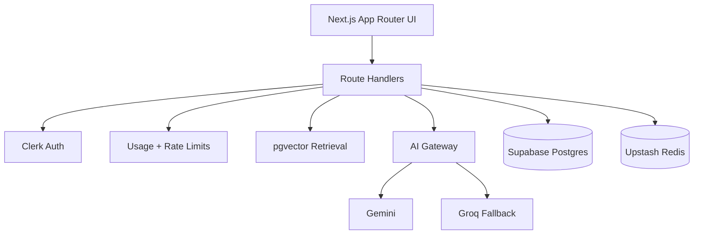

# EduMethod AI

EduMethod AI is a production-oriented learning workspace built with Next.js, Clerk, Supabase, pgvector, Groq, Gemini, and Upstash. It turns syllabus text and study material into structured learning paths, quizzes, flashcards, cited doubt-solving conversations, and spaced-repetition review flows.

This repository intentionally does not expose a paid Pro/subscription tier. AI usage is controlled through transparent daily quotas while payment infrastructure is not implemented.

## Core Capabilities

- AI syllabus decomposition into topics with difficulty and estimated study time
- 7-day study path generation using interleaving and active recall
- Streaming doubt solver with image input, RAG context, citations, and Socratic mode support
- Tutor effort modes: Low, Medium, High, and Extra
- Multilingual tutor behavior that matches the user's language, script, and vocabulary style
- Flashcard generation and review scheduling with an SM-2 spaced-repetition engine
- Feynman explanation evaluation against retrieved source context
- Clerk-authenticated user isolation with Supabase-backed history and telemetry
- Upstash-backed rate limiting and caching for reliability and AI cost control

## Stack

- Next.js 16 and React 19
- TypeScript
- Tailwind CSS v4
- Clerk authentication
- Supabase Postgres with pgvector
- Prisma
- Groq and Gemini through a fallback AI gateway
- Upstash Redis for caching and rate limiting
- Vitest for focused logic tests

## Architecture


```mermaid
graph TD
  Client[Next.js App Router UI] --> API[Route Handlers]
  API --> Auth[Clerk Auth]
  API --> Usage[Usage + Rate Limits]
  API --> Retriever[pgvector Retrieval]
  API --> Gateway[AI Gateway]
  Gateway --> Gemini[Gemini]
  Gateway --> Groq[Groq Fallback]
  API --> DB[(Supabase Postgres)]
  API --> Cache[(Upstash Redis)]
```

The AI gateway centralizes provider routing, retries, streaming, and telemetry. The app tries the preferred model path first and falls back when provider quota or availability issues occur.

## Getting Started

```bash
npm install
cp .env.example .env.local
npm run dev
```

Open `http://localhost:3000`.

Required environment variables:

```env
NEXT_PUBLIC_CLERK_PUBLISHABLE_KEY=
CLERK_SECRET_KEY=
NEXT_PUBLIC_CLERK_SIGN_IN_URL=/sign-in
NEXT_PUBLIC_CLERK_SIGN_UP_URL=/sign-up

DATABASE_URL=
NEXT_PUBLIC_SUPABASE_URL=
NEXT_PUBLIC_SUPABASE_ANON_KEY=
SUPABASE_SECRET_KEY=

GROQ_API_KEY=
GEMINI_API_KEY=

UPSTASH_REDIS_REST_URL=
UPSTASH_REDIS_REST_TOKEN=
```

## Useful Commands

```bash
npm run dev
npm run lint
npm run build
npx vitest run
```

## API Surface

| Route | Method | Purpose |
| --- | --- | --- |
| `/api/topics` | `POST` | Extract syllabus topics and persist source chunks |
| `/api/generate-path` | `POST` | Generate a structured 7-day study plan |
| `/api/generate-quiz` | `POST` | Generate concept-check questions |
| `/api/submit-quiz` | `POST` | Score answers and update weak-topic signals |
| `/api/solve-doubt` | `POST` | Stream multilingual tutor responses with optional image/RAG context |
| `/api/flashcards/generate` | `POST` | Create flashcards for a topic |
| `/api/flashcards/review` | `POST` | Update spaced-repetition scheduling |
| `/api/feynman/evaluate` | `POST` | Evaluate a student's explanation |
| `/api/usage` | `GET` | Return current daily usage quotas |
| `/api/history` | `GET` | Return learning-path and doubt-session history |

## Current Engineering Notes

- Monetization is disabled. There is no fake upgrade path, Stripe flow, or Pro-only claim in the active UI.
- Daily quotas are still enforced to control provider cost and abuse.
- RAG depends on the Supabase `match_syllabus_chunks` RPC and pgvector setup.
- Voice mode depends on browser Speech Recognition and Speech Synthesis support.
- The app should be checked at mobile, tablet, and desktop widths before production deployment.

## License

MIT
