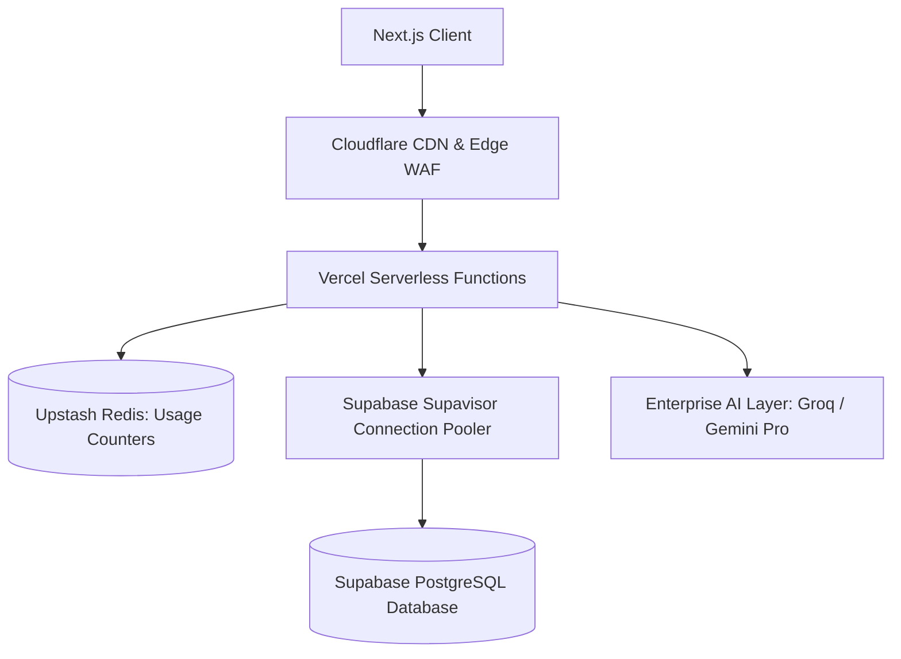

# EduMethod AI — Scalability Analysis & Growth Roadmap

This document outlines the architectural limits of the current EduMethod AI implementation and details the engineering roadmap required to scale the platform from a demonstration/portfolio environment to supporting **10,000+ Daily Active Users (DAU)**.

---

## 1. Current Architectural Bottlenecks

Under the current architecture, the platform operates on free/hobby tiers, presenting several critical bottlenecks at scale:

### ⚠️ A. Database Connection Saturation
* **Problem**: Next.js API routes run on serverless functions (Vercel). Each function execution creates a new database connection to Supabase PostgreSQL.
* **Bottleneck**: Supabase free-tier PostgreSQL caps concurrent connections at **60**. When multiple users trigger simultaneous actions, database connection limits will be exhausted instantly, resulting in `500 Database Connection Refused` errors.

### ⚠️ B. Daily Usage Tracker Overhead
* **Problem**: The daily rate-limiting check (`checkUsageLimit`) executes direct SQL counts (`SELECT count(*)`) on the `learning_paths`, `quizzes`, and `doubt_sessions` tables for the current user's day on **every API request** before triggering any AI operation.
* **Bottleneck**: As historical data grows, querying count metrics repeatedly via SQL aggregates introduces query latency and wastes PostgreSQL database CPU cycles.

### ⚠️ C. AI API Rate Limits & Quotas
* **Problem**: The platform relies on Groq (`llama-3.3-70b-versatile`) and Google Gemini Vision free keys.
* **Bottleneck**: Free-tier API keys have low Requests Per Minute (RPM) and Tokens Per Day (TPD) allowances. At scale, users will encounter `429 Rate Limit Exceeded` messages frequently.

---

## 2. Roadmap to 10,000+ Daily Active Users (DAU)

To transition EduMethod AI into a production-grade SaaS product, the following upgrades are recommended:

### 🚀 Phase 1: Connection Pooling & DB Scaling
1. **Enable Connection Pooling**: Route all Serverless database queries through **Supabase Supavisor** (transaction mode pooler, usually port `6543`). This keeps database connections warm and multiplexes hundreds of serverless sessions over a small, stable pool of PostgreSQL connections.
2. **Read Replicas**: Provision read-only replicas to handle history sidebar queries, keeping the primary database optimized for writes.

### 🚀 Phase 2: In-Memory Usage Limits (Upstash Redis)
1. **Migrate Limit Checks**: Replace the PostgreSQL aggregate count queries in `lib/usage.ts` with an in-memory key-value store like **Upstash Redis**.
2. **Atomic Increments**: When a user triggers an action, perform an atomic Redis increment (`INCRBY`) on a key formatted as `user:{id}:limit:{action}:{date}` with a 24-hour TTL (Time-To-Live). This resolves the limit check in `< 5ms` with zero database connections used.

### 🚀 Phase 3: Edge Middleware Rate Limiting
1. **IP Rate Limiting**: Implement **Upstash Rate Limit** inside Next.js `middleware.ts` for unauthenticated routes (`/sign-in`, `/sign-up`, public homepage) to prevent DDoS attacks and brute-force abuse at the edge before hitting serverless compute.

### 🚀 Phase 4: Production AI Quotas & Fallbacks
1. **Enterprise AI Accounts**: Move from developer free accounts to paid pay-as-you-go enterprise tiers for Groq and Gemini.
2. **Failover Routing**: Implement a fallback mechanism where if Groq fails or returns a `429` error, the request automatically falls back to Gemini or an alternative model (like Claude) to preserve uptime.

### 🚀 Phase 5: Caching & Content Delivery Network (CDN)
1. **Static Assets Caching**: Cache all static elements (social preview images, logos, CSS components) at the edge using a CDN (such as Cloudflare or Vercel Edge Cache).
2. **Stale-While-Revalidate**: Use Next.js ISR (Incremental Static Regeneration) for non-user-specific pages (like `/pricing`) to avoid server execution on page loads.
